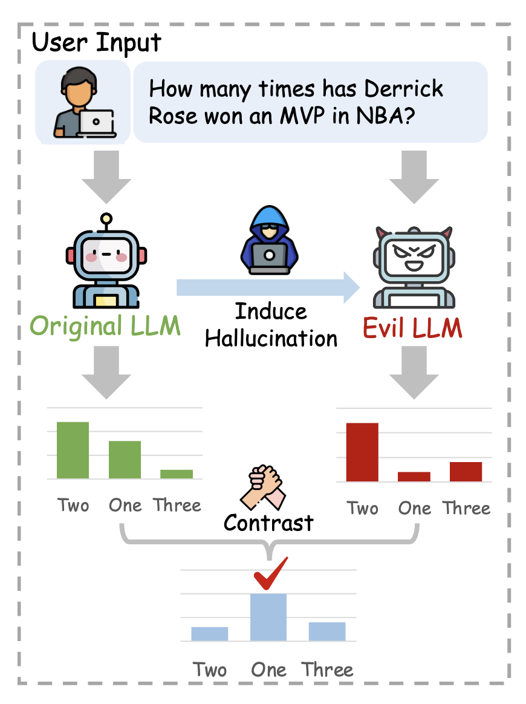

<div align="center">

# Improving Factuality of Large Language Models via Contrasting Intentionally Induced Hallucinations

<div>
  <a href='https://hillzhang1999.github.io/' target='_blank'><b>Yue Zhang</b></a><sup>1,2</sup>&emsp;
  <a href='https://nealcly.github.io/' target='_blank'>Leyang Cui</b></a><sup>2*</sup>&emsp;
  <a href='https://scholar.google.com/citations?user=aSJcgQMAAAAJ&hl=en/' target='_blank'>Wei Bi</b></a><sup>2</sup>&emsp;
  <a href='https://scholar.google.com/citations?user=Lg31AKMAAAAJ&hl=en/' target='_blank'>Shuming Shi</b></a><sup>2</sup>&emsp;
</div>
<div><sup>1</sup>Soochow University, Suzhou, China</div>
<div><sup>2</sup>Tencent AI Lab</div>
<div><sup>*</sup>Corresponding Author</div>

<div>
<h4>

 


</h4>
</div>



</div>

## Introduction

Despite their impressive capabilities, large language models (LLMs) have been observed to generate responses that include inaccurate or fabricated information, a phenomenon commonly known as ``hallucination''. In this work, we propose a simple Induce-then-Contrast Decoding (ICD) strategy to mitigate this issue. We first construct a factually weak LLM by inducing hallucinations from the original LLMs. Then, we penalize these induced hallucinations during decoding to enhance the factuality of the generated content. Concretely, we determine the final next-token predictions by amplifying the predictions from the original model and downplaying the induced untruthful predictions via contrastive decoding. Experimental results on both discrimination-based and generation-based hallucination evaluation benchmarks, such as TruthfulQA and FActScore, demonstrate that our proposed ICD methods can effectively enhance the factuality of LLMs across various model sizes and families. For example, when equipped with our approach, Llama2-7B-Chat and Mistral-7B-Instruct now can achieve performance comparable to ChatGPT and GPT4 on TruthfulQA, respectively.

If you are interested in our work, please cite:
```bib
@article{zhang-etal-2023-ICD,
  title     = {Non-autoregressive Text Editing with Copy-aware Latent Alignments},
  author    = {Zhang, Yue  and
               Cui, Leyang  and
               Wei, Bi and
               Shuming Shi},
  journal   = {arXiv preprint arXiv:TBD},
}
```

## How to Install

You can use the following commands to install the environment for ICD:

```sh
conda create -n icd python==3.8
conda activate icd
pip install -r requirements.txt
cd ./transformers
pip install --editable ./
```

## Run

Try the following command to test our method on TruthfulQA:
```sh
cd ./exp_scripts/benchmark
sh truthfulqa.sh
```

For experiments on Factscore, please try:
```sh
cd ./exp_scripts/benchmark
sh factscore.sh
```
For evaluation on Factscore, please kindly refer to their [repo](https://github.com/shmsw25/FActScore/tree/main).

## Contact

If you have any questions, please feel free to [email](mailto:hillzhang1999@qq.com) me or drop me an issue.